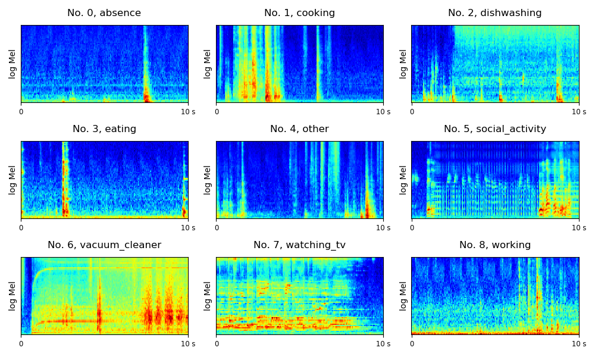

# DCASE 2018 Task 5 Monitoring of domestic activities based on multi-channel acoustics

DCASE 2018 Task 5 is a challenge to classify multi-channel audio segments acquired by a microphone array, into one of the provided predefined classes. These classes are daily activities performed in a home environment (e.g. "Cooking"). More details about this challenge can be found in http://dcase.community/challenge2018/task-monitoring-domestic-activities

## DATASET

The dataset is downloadable from http://dcase.community/challenge2018/task-monitoring-domestic-activities

### Statistics of development data

|                                                     | Development data | Test data |
|:---------------------------------------------------:|------------------|-----------|
| Absence (nobody present in the room)                | 18860            | Unknown   |
| Cooking                                             | 5124             | Unknown   |
| Dishwashing                                         | 1424             | Unknown   |
| Eating                                              | 2308             | Unknown   |
| Other (present but not doing any relevant activity) | 2060             | Unknown   |
| Social activity (visit, phone call)                 | 4944             | Unknown   |
| Vacuum cleaning                                     | 972              | Unknown   |
| Watching TV                                         | 18648            | Unknown   |
| Working (typing, mouse click, ...)                  | 18644            | Unknown   |
| **Total**                                           | **72984**        | **72792   |

The log mel spectrogram of the scenes are shown below:

The names of the audios are:
<pre>
No. 0, DevNode1_ex10_1.wav
No. 1, DevNode1_ex43_1.wav
No. 2, DevNode1_ex56_1.wav
No. 3, DevNode1_ex66_1.wav
No. 4, DevNode1_ex100_1.wav
No. 5, DevNode1_ex197_1.wav
No. 6, DevNode1_ex218_1.wav
No. 7, DevNode1_ex227_1.wav
No. 8, DevNode1_ex236_1.wav
</pre>

## Run the code

**0. Prepare data**
Download and unzip the data. The data structure should look like:
<pre>
.
├── DCASE2018-task5-dev
│     ├── audio (72984 audios)
│     │     └── ...
│     ├── evaluation_setup
│     │     └── ...
│     ├── meta.txt
│     └── ...
└── DCASE2018-task5-eval
      ├── audio (72972 audios)
      │     └── ...
      ├── evaluation_setup
      │     └── ...
      ├── meta.txt
      └── ...
</pre>

**1. (Optional) Install dependent packages.** If you are using conda, simply run:

$ conda env create -f environment.yml

$ conda activate py5_dcase2018_task5

**2. Then simply run:**

$ ./runme.sh

Or run the commands in runme.sh line by line, including: 

(1) Modify the paths of data and your workspace

(2) Extract features

(3) Train model

(4) Evaluation

The training looks like:

<pre>
root        : INFO     Load data time: 28.924594402313232
root        : INFO     Training audios: 54964
root        : INFO     Validation audios: 18020
root        : INFO     iteration: 0, train time: 0.004 s, validate time: 1.801 s
root        : INFO     tr_acc: 0.029, tr_f1_score: 0.027, tr_loss: 3.246
root        : INFO     va_acc: 0.031, va_f1_score: 0.031, va_loss: 3.163
root        : INFO     
root        : INFO     iteration: 200, train time: 5.318 s, validate time: 1.849 s
root        : INFO     tr_acc: 0.899, tr_f1_score: 0.831, tr_loss: 0.301
root        : INFO     va_acc: 0.855, va_f1_score: 0.763, va_loss: 0.438
......
root        : INFO     iteration: 5000, train time: 6.254 s, validate time: 2.057 s
root        : INFO     tr_acc: 0.983, tr_f1_score: 0.971, tr_loss: 0.067
root        : INFO     va_acc: 0.886, va_f1_score: 0.861, va_loss: 0.337
......
</pre>

## Result

We apply a convolutional neural network on the log mel spectrogram feature to solve this task. Training takes around 100 ms / iteration on a GTX Titan X GPU. The model is trained for 5000 iterations. The result is shown below. 

We show the evaluation F1 score trained on the 2, 3 and 4 folds and validated on the 1st fold. 

| Class name                                          | F1 score  |
|-----------------------------------------------------|-----------|
| Absence (nobody present in the room)                | 0.849     |
| Cooking                                             | 0.974     |
| Dishwashing                                         | 0.832     |
| Eating                                              | 0.806     |
| Other (present but not doing any relevant activity) | 0.464     |
| Social activity (visit, phone call)                 | 0.955     |
| Vacumm cleaning                                     | 1.000     |
| Watching TV                                         | 0.997     |
| Working (typing, mouse click, ...)                  | 0.842     |
| **Average**                                         | **0.857** |

## Summary
This codebase provides a convolutional neural network (CNN) for DCASE 2018 challenge Task 5. 

### External link

The official baseline system implemented using Keras can be found in https://github.com/DCASE-REPO/dcase2018_baseline
